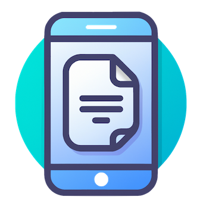

# ScanNow

  

A fast and simple app for document scanning on iOS.

## Features

- Scan documents quickly and easily
- Adjust scan settings as needed, including the filename and format of the shared document
- Send scanned documents to any place you want

## Privacy

This app does not collect any data. It contains only 3 screens: scanner, settings, and share a document. Nothing more.

## Getting Started

1. Clone or download the repository
2. Open the project in Xcode
3. Build and run the app on a simulator or device

## Contributing

Pull requests are welcome. For major changes, please open an issue first to discuss what you would like to change.

## License

This project is licensed under the MIT license. See the [LICENSE](LICENSE) file for more information.

## Acknowledgements

- The app logo was generated using DALLE.
- This README file was generated by an AI assistant trained by OpenAI.
