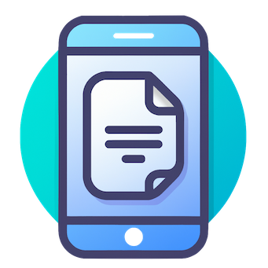

# ScanNow

  

A fast and simple app for document scanning on iOS.

## Download on the App Store

Get the latest version of ScanNow on the [App Store](https://apps.apple.com/pl/app/scan-now/id1660940489).

## Features

- Scan documents quickly and easily
- Adjust scan settings as needed, including the filename and format of the shared document
- Send scanned documents to any place you want

## Privacy

This app does not collect any data. It contains only 3 screens: scanner, settings, and share a document. Nothing more.

## Getting Started

1. Clone or download the repository
2. Make sure you have [Mint](https://github.com/yonaskolb/Mint) installed on your machine. If you don't, you can install it by running `brew install mint`
3. Run `mint bootstrap` to install the tools required for the project.
4. Open the project in Xcode
5. Build and run the app on a simulator or device

## Accessing Error Logs and Debugging

If you encounter any errors or issues while using the app, you can access the error logs in the `fastlane/metadata/en-GB/error_logs.txt` file. Please provide the contents of this file along with a detailed description of the problem when reporting issues in the GitHub issue tracker. This will help us identify and resolve the issue effectively. Thank you for your cooperation.

Note: Mint is used to manage tools required by the project. By installing dependencies using Mint, you can ensure that you have the correct version of tools for the project to build successfully.

## Contributing

### Reporting Issues and Error Logs

If you encounter any issues while using the app or run into errors, please provide detailed error logs and descriptions in the GitHub issue tracker. This will help us investigate and address the problem effectively. Thank you for your cooperation.

Pull requests are welcome. For major changes, please open an issue first to discuss what you would like to change.

## License

This project is licensed under the MIT license. See the [LICENSE](LICENSE) file for more information.

## Acknowledgements

- The app logo was generated using DALLE.
- This README file was generated by an AI assistant trained by OpenAI.
